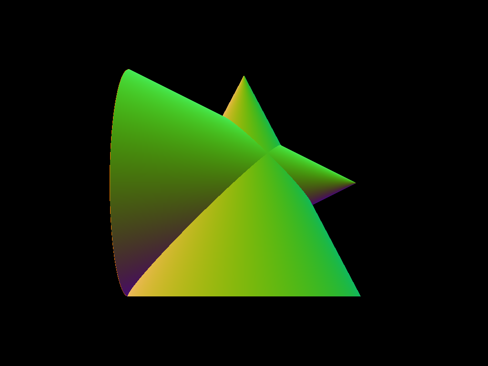
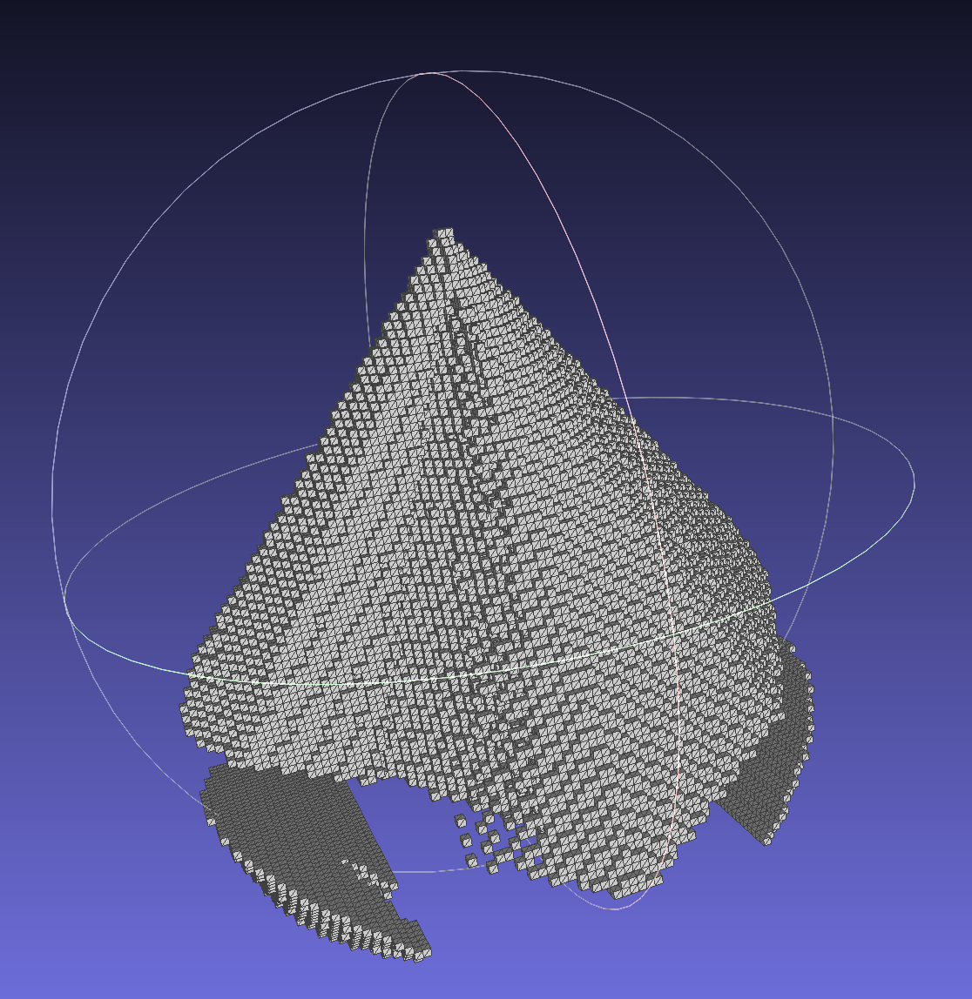

# 3D Reconstruction

## Overview

3D reconstruction from multiple views is a technique to convert multiple images, typically photographs, of an object or scene and deduce the 3D geometry contained within.

One broad approach is voxel based, where a voxel is the 3D equivalent of a pixel, i.e. a cube with volume. The intuition behind voxel based approaches is that a block of voxels can behave analogously to a lump of clay and each additional image can "carve" away voxels until the only ones that remain are consistent with the image.

## Approaches

### Visual Hull
The basic approach is to use a silhouette-based visual hull approach, where for each photo, each voxel is projected onto the image. If it is projected onto a foreground pixel, then it stays. If it is projected onto a background pixel, then it is carved away. 

This approach works fairly well for convex shapes whose foregrounds and backgrounds are clearly delineated.

### Voxel Carving
One downside of visual hull is that it fails to capture leverage color information in the images. This is what photo-consistent approaches like voxel carving try to use. Assuming the scene is dominated by diffuse Lambertian radiance, which reflects lightly uniformly in all directions, the color of a particular point of a particular object will be view-independent. This color can then be correlated accross images.

The broad strokes of this approach are as follows. First find an axial ordering of the voxels such that occluding voxels are visited before occluded ones, which also requires all the cameras exist outside of the convex hull of the scene. Then, construct a "sweep plane" perpendicular to that axis to "sweep" across the scene. At each step, intersect the plane with the voxels. For each voxel that has not been carved, project it onto each image it can see. If all the projected colors are similar, then it is photo-consistent. Otherwise it should be carved away. Repeat until the sweep plane is passed through all layers of the scene. Only photo-consistent voxels should remain.

### Space Carving
As laid out in the paper _A Theory of Shape by Space Carving_, this approach is an extension of the voxel carving approach and loosens some restrictions, notably that there does not have to be a single view-independent ordering of the voxels and cameras can exist in the convex hull.

Instead of just sweeping a plane in one direction, this approach sweeps along all six axial directions. To ensure visibility ordering, each sweep only takes into account the cameras that are pointing in the correct axial direction. Since not every camera will particate in each sweep, this multi-plane sweep will continue until no voxels are carved in one round of six sweeps.

## Implementation

I wrote this implementation in Rust and used a previously written ray tracer to generate multiple synthetic views of Lambertian objects.

The visual hull approach works reasonably for simple shapes, like this sphere with four views and few voxels, and this cone with nine views and more voxels.

<table>
    <th>Input</th>
    <th>Output</th>
  <tr>
    <td> </td>
    <td> </td>
   </tr> 
  </tr>
  <tr>
    <td> </td>
    <td> </td>
   </tr> 
  </tr>
</table>

It struggles more complex shapes like these two combined cones. The quality of the reconstruction depends a lot on the input, as many images from different angles are required to capture the silhouette properly and concavities are somewhere between very tricky and impossible.

<table>
    <th>Input</th>
    <th>Output</th>
  <tr>
    <td> </td>
    <td> </td>
   </tr> 
  </tr>
  </tr>
</table>

The voxel carving approach works well when the colors on the shape are similar but my implementation struggles a bit with occlusion and voxels are erroneously labeled as inconsistent. This can be seen in these two cones which are generated from two distinct subsets of the images: one from each side.

<table>
  <tr>
    <td> </td>
    <td> </td>
   </tr> 
  </tr>
  <tr>
    <td> </td>
    <td> </td>
   </tr> 
  </tr>
</table>

I believe I broadly implemented space carving as described but this issue with occlusion suggests there is a pernicious bug somewhere. It's possible but unlikely to be a projection issue as the visual hull is projected accurately. Decreasing the number of cameras used helped but lowered the quality of the reconstruction, as did increasing the color tolerance.

The described approach uses visibilty ordering and marking pixels involved in consistent colorings so that future voxels projected to those marked pixels will ignore them. Since an occluding voxel will be visited before an occluded voxel, the pixel they both project to will be marked by the occluder and thus ignored by the occluded, in theory at least.

I attempted to work around by computing occlusion in other ways. One failed approach was to use ray tracing to directly trace a ray from the camera through the pixel to the center of the voxel. If the ray intersected any voxel before the voxel in question, then it would be occluded. In addition to being much more computationally expensive, the number of false positives from corners and edges of voxels being intercepted made the approach too unreliable to use. Ray tracing the other way (from voxel to pixel) also suffered the same fate.

I also tried projecting the entire voxel to the pixels of each image instead of just the center of the voxel to one pixel. The idea is that any consistent coloring would mark all the projected pixels and improve occlusion calculations. The problem is that it is incredibly computationally expensive to shoot rays from each pixel in each image to each voxel and see if they intersect.
